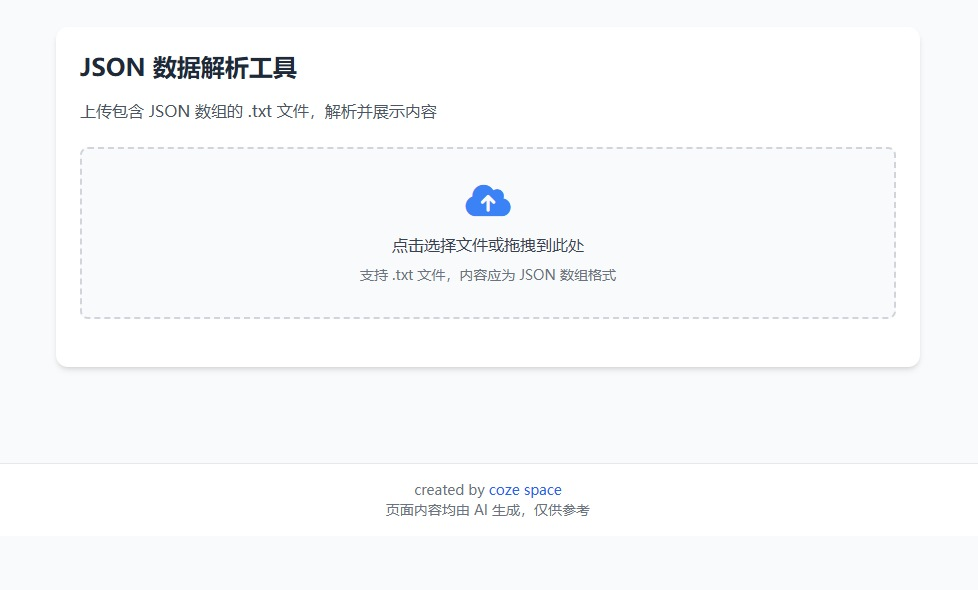
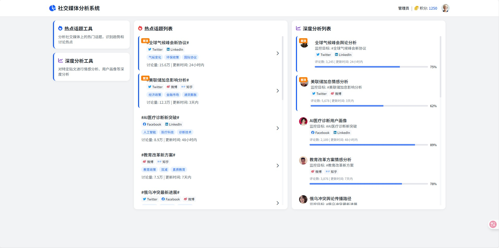

扣子空间(Cozi)是一个强大的通用Agent工具，在我的前端开发工作中已成为得力助手。

## 实际应用体验

我已在多个项目中成功使用扣子空间完成代码工作：
- 快速生成标准化HTML模板
- 自动创建响应式页面结构
- 批量处理重复性页面元素
- 生成可即时预览的组件代码

特别是在页面生成方面，扣子空间已经能够满足我80%的基础页面构建需求，大大提升了开发效率。

## 部署优势

扣子空间不仅支持代码生成，还提供便捷的页面部署展示功能：
1. 一键部署生成的页面
2. 实时预览效果
3. 支持版本对比
4. 可分享演示链接

## 工作流程优化

传统方式 | 使用扣子空间
--- | ---
手动编写HTML结构 | 自动生成基础框架
重复创建相似组件 | 批量生成变体
手动部署测试 | 即时预览部署

## 案例
### 1. 设计完成对json数据的筛选转换工具
> 需求：我有一个文件，我想实现一个页面，展示其内容（title、summary、url(超链接)），点击summary显示 content_original内容，支持勾选指定内容（多选），并导出markdown，导出文件格式（序号. title \n url \n summary）

### 2. 设计社交媒体内容分析的首页
> 需求：参考图片是一个社交媒体的分析系统（我对这个很不满意，希望你的方案能让我眼前一亮），整体页面有三栏，第一栏是工具箱，包括2个工具，热点话题（用户关注的社交平台的热点话题）、深度分析（对某贴文的深度分析），帮我设计一下，风格现代化一点，界面颜色搭配要合理舒适

